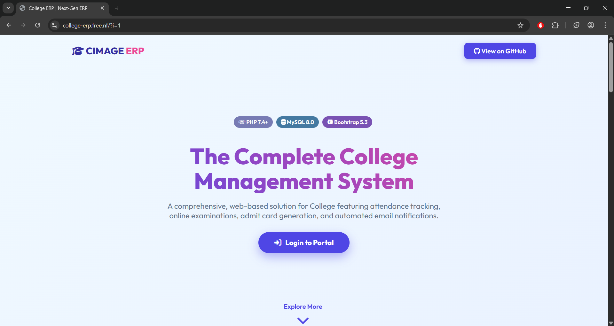
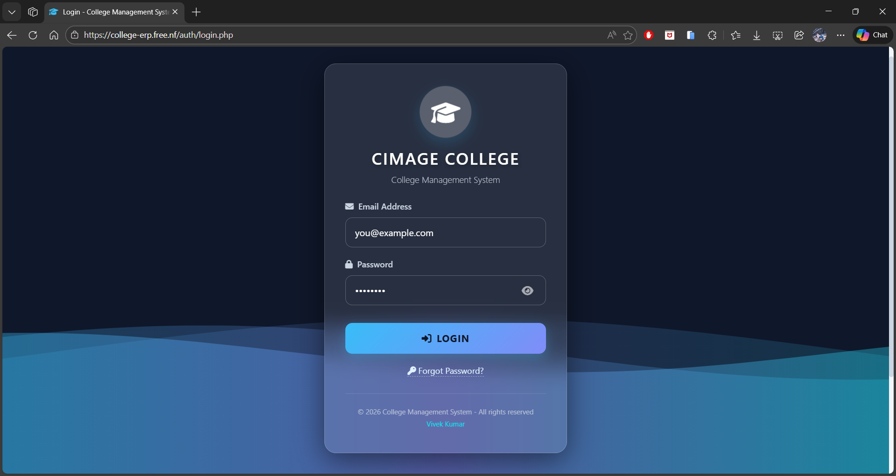
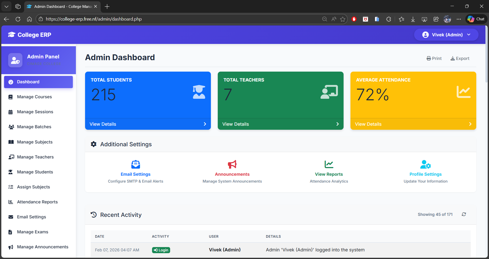
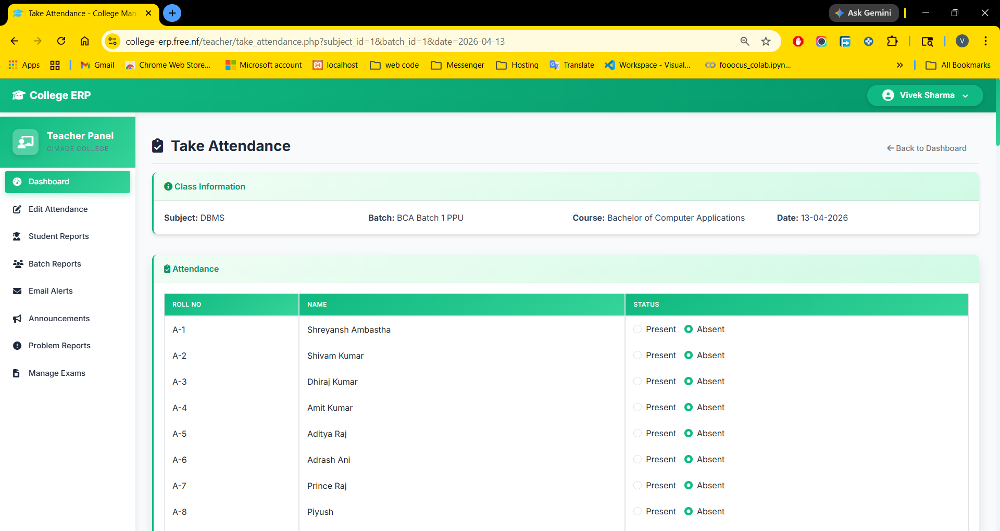
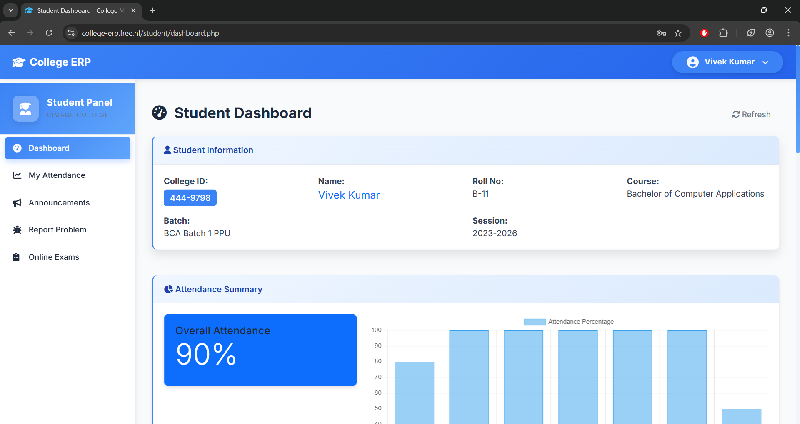
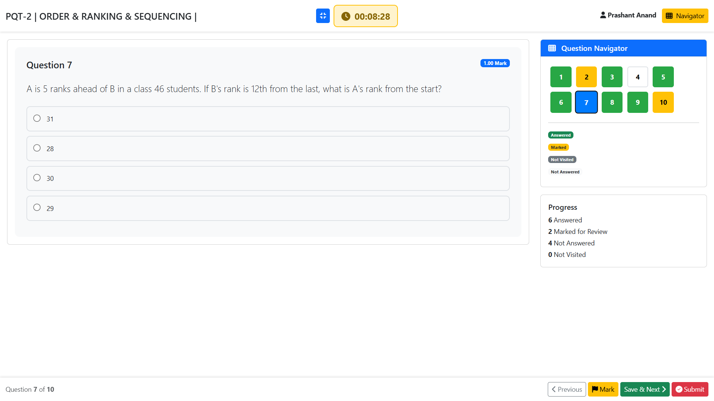
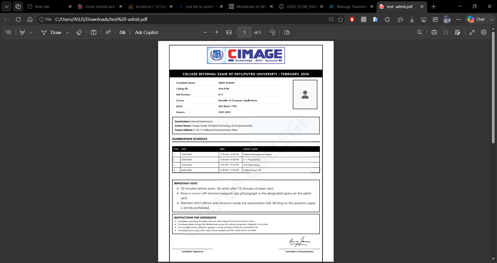

# 🎓College ERP - College Management System
Portal Link -> https://college-erp.free.nf

A comprehensive web-based College Management System with attendance tracking, online examinations, admit card generation, automated email notifications and report generation(PDF/CSV).


---

## ✨ Features

### 🔐 Authentication & Security
- **Modern Glass Design Login** with animated SVG waves
- Password visibility toggle
- OTP-based password reset via email
- CSRF protection on all forms
- Bcrypt password hashing
- Session management with role-based access

### 👥 Role-Based Access Control

#### 👨‍💼 Admin Panel
- Dashboard with statistics (students, teachers, attendance %)
- Manage courses, sessions, batches, and subjects
- Create and manage teacher/student accounts
- Assign teachers to subjects and batches
- Generate and publish exam admit cards
- Configure SMTP email settings
- Create system-wide announcements
- View detailed attendance reports with charts
- Activity logging for all actions

#### 👨‍🏫 Teacher Panel
- Take daily attendance for assigned classes
- Edit attendance (last 15 days only)
- Create and manage online exams
- Question bank management
- View student performance reports
- Batch-wise attendance analytics with charts
- Send bulk email alerts to students
- Handle student problem reports
- Export reports to PDF

#### 👨‍🎓 Student Panel
- View attendance (daily/monthly/subject-wise)
- Download attendance reports as PDF
- Take online exams with timer
- View exam results and history
- Download admit cards
- Submit problem reports to teachers
- View announcements

### 📊 Attendance Management
- Mark attendance: **Present** or **Absent** (2 statuses)
- Automatic email alerts for low attendance
- Edit window: Last 15 days with audit trail
- Real-time attendance statistics
- Subject-wise and batch-wise reports
- Monthly attendance charts
- PDF export with letterhead

### 📝 Online Examination System
- Create exams with multiple question types
- Timer-based exam system
- Auto-submit on time expiry
- Violation detection (tab switch, copy/paste, right-click)
- Automatic grading
- Detailed result analysis
- PDF certificates
- Exam statistics for teachers

### 🎫 Admit Card System
- Create admit cards for exams
- Customizable exam schedule (date, time, subject)
- Multiple examination centers
- Auto-generate PDF admit cards
- Email notifications to students
- Download from student portal
- Track download statistics

### 📧 Email Notification System
- SMTP configuration (Gmail, SendGrid, etc.)
- Low attendance alerts
- Admit card notifications
- Exam result notifications
- Password reset OTPs
- Bulk email functionality
- Email logs and tracking

### 📈 Reports & Analytics
- Attendance percentage charts
- Student-wise performance reports
- Batch-wise analytics
- Monthly attendance trends
- Exam statistics
- Export to PDF/CSV

---

## 📸 Screenshots

### Landing Page - Modern Design With Features Listing

Sleek homepage showcasing all key features with responsive design

### Login Page - Glass Design with SVG Waves

Modern glassmorphism design with animated wave background and password visibility toggle

### Admin Dashboard

Comprehensive statistics and quick access to all management features - view student count, teacher count, average attendance at a glance

### Teacher Attendance Marking

Easy-to-use interface for marking daily attendance with Present/Absent/Leave options and batch-wise class selection

### Student Dashboard

Clean interface showing attendance summary, upcoming exams, and student information with real-time statistics

### Online Exam Interface

Distraction-free exam taking with timer, question navigator, violation detection (tab switch monitoring), and auto-save functionality

### Admit Card

Professional admit card PDF with exam schedule, center details, candidate information, and instructions

---

## 🛠 Technology Stack

### Frontend
- **HTML5** - Semantic markup
- **CSS3** - Glassmorphism design, animations
- **JavaScript (ES6)** - Modern JS features
- **jQuery 3.6** - DOM manipulation
- **Bootstrap 5.3** - Responsive framework
- **Font Awesome 6.4** - Icon library
- **Chart.js** - Data visualization
- **SweetAlert2** - Beautiful alerts

### Backend
- **PHP 7.4+** - Server-side logic
- **MySQL 8.0** - Database
- **PDO** - Database abstraction
- **PHPMailer** - Email sending
- **TCPDF** - PDF generation
- **Composer** - Dependency management

### Security
- **HTTPS** - Secure communication
- **Prepared Statements** - SQL injection prevention
- **Password Hashing** - Bcrypt algorithm
- **CSRF Tokens** - Cross-site request forgery protection
- **Session Security** - Secure session management
- **XSS Prevention** - Output escaping

---

## 💻 Installation

### Prerequisites
- **PHP 7.4 or higher**
- **MySQL 8.0 or higher**
- **Apache/Nginx** web server
- **Composer** (optional, for dependencies)
- **SMTP account** (Gmail, SendGrid, etc.) for emails


## 📖 Usage

### For Administrators

#### Creating Courses and Batches
1. Login as Admin
2. Navigate to **Manage Courses** → Create new course (e.g., BCA, MCA)
3. Navigate to **Manage Sessions** → Create session (e.g., 2023-2026)
4. Navigate to **Manage Batches** → Create batch and assign to course/session

#### Adding Teachers
1. **Manage Teachers** → Add New Teacher
2. Fill in details (name, email, designation)
3. System creates login credentials automatically
4. Assign subjects: **Assign Subjects** → Select teacher, subject, batch.

#### Adding Students
1. **Manage Students** → Add New Student
2. Provide roll number, college ID, course, session, batch
3. System creates login credentials
4. Students can login with email and default password

#### Creating Admit Cards
1. **Manage Exams** → Create Admit Card
2. Fill exam details, select course/session/batch
3. Add exam schedule (dates, subjects, timings)
4. Select examination center
5. Choose to publish immediately or save as draft
6. Enable "Auto-Send Emails" to notify students

### For Teachers

#### Taking Attendance
1. Navigate to **Dashboard** or **Take Attendance**
2. Select subject, batch, and date
3. Mark students as Present or Absent
4. Click Save - students with low attendance receive email alerts

#### Editing Attendance
1. **Edit Attendance** → Select date (within last 15 days)
2. Modify attendance records
3. Provide edit reason - changes are logged

#### Creating Online Exams
1. **Manage Exams** → Create New Exam
2. Set exam title, subject, duration, start/end time
3. Add questions (MCQ, True/False, Short Answer)
4. Or import from Question Bank
5. Publish exam when ready

#### Viewing Reports
1. **Student Reports** → Select student → View attendance/exam performance
2. **Batch Reports** → Batch-wise attendance analytics
3. Export to PDF for offline viewing

### For Students

#### Checking Attendance
1. **Dashboard** → View attendance summary
2. **My Attendance** → Detailed view (daily/monthly/subject-wise)
3. Download PDF report

#### Taking Exams
1. **Online Exams** → View available exams
2. Click **Start Exam** (must be within exam window)
3. Answer questions - auto-saves progress
4. Click **Submit** or wait for auto-submit
5. View result immediately after submission

#### Downloading Admit Cards
1. **Admit Cards** → View published admit cards
2. Click **Download** to get PDF
3. Print and bring to exam center

---

## 📁 Project Structure

```
ERP/
├── admin/                  # Admin panel files
│   ├── dashboard.php
│   ├── manage_courses.php
│   ├── manage_students.php
│   ├── manage_teachers.php
│   ├── assign_subjects.php
│   ├── email_settings.php
│   └── manage_exams.php    # Admit card system
│
├── teacher/                # Teacher panel files
│   ├── dashboard.php
│   ├── take_attendance.php
│   ├── edit_attendance.php
│   ├── student_reports.php
│   ├── batch_reports.php
│   ├── manage_exams.php    # Online exams
│   ├── question_bank.php
│   └── email_alerts.php
│
├── student/                # Student panel files
│   ├── dashboard.php
│   ├── attendance_report.php
│   ├── take_exam.php
│   ├── exam_result.php
│   ├── exam_history.php
│   └── admit_card.php
│
├── api/                    # REST-like API endpoints
│   ├── admin/
│   ├── teacher/
│   ├── student/
│   ├── auth/
│   └── common/
│
├── auth/                   # Authentication
│   ├── login.php           # Glass design login
│   ├── forgot_password.php
│   └── logout.php
│
├── includes/               # Shared components
│   ├── header.php          # Sidebar navigation
│   ├── footer.php
│   ├── security.php        # CSRF, validation
│   ├── email_helper.php    # Email functions
│   ├── pdf_generator.php   # PDF creation
│   └── activity_logger.php # Activity logging
│
├── config/                 # Configuration
│   ├── database.php
│   └── email_config.php
│
├── database/               # SQL files
│   ├── schema.sql          # Main database schema
│   ├── sample_data.sql
│   └── migrations/
│
├── assets/                 # Static files
│   ├── css/
│   │   ├── style.css
│   │   ├── teacher-style.css
│   │   └── student-style.css
│   └── js/
│       └── custom.js
│
├── uploads/                # File uploads
├── temp/                   # Test files
└── vendor/                 # Composer dependencies
```

---

## 🔌 API Documentation

### Authentication
- `POST /api/auth/login.php` - User login
- `POST /api/auth/forgot_password_request.php` - Request OTP
- `POST /api/auth/verify_otp.php` - Reset password

### Admin APIs
- `GET /api/admin/dashboard_data.php` - Dashboard statistics
- `POST /api/admin/create_admit_card.php` - Create admit card
- `POST /api/admin/send_admit_card_emails.php` - Send emails

### Teacher APIs
- `POST /api/teacher/save_attendance.php` - Save attendance
- `GET /api/teacher/student_attendance_report.php` - Student report
- `POST /api/teacher/save_question.php` - Save exam question

### Student APIs
- `GET /api/student/detailed_attendance.php` - Attendance details
- `POST /api/student/start_exam.php` - Start exam
- `POST /api/student/submit_exam.php` - Submit exam
- `GET /api/student/get_admit_cards.php` - Get admit cards

All APIs return JSON responses with `success` and `data/error` fields.

---

## 🔒 Security

### Implemented Security Measures
- ✅ **SQL Injection Prevention** - PDO prepared statements
- ✅ **XSS Protection** - Output escaping with `htmlspecialchars()`
- ✅ **CSRF Protection** - Tokens on all forms
- ✅ **Password Security** - Bcrypt hashing (cost: 12)
- ✅ **Session Security** - Regenerate ID after login
- ✅ **Input Validation** - Server-side validation
- ✅ **Activity Logging** - All admin/teacher actions logged
- ✅ **Exam Violations** - Tab switch, copy/paste detection
- ✅ **Rate Limiting** - OTP request limits
- ✅ **HTTPS Ready** - Secure in production

### Security Best Practices
1. Always use HTTPS in production
2. Change default passwords immediately
3. Keep PHP and MySQL updated
4. Regular database backups
5. Restrict file upload types
6. Monitor activity logs
7. Use strong SMTP passwords

---

## 🐛 Known Issues

- Sidebar scroll may need adjustment for very long menus
- Email sending may fail if SMTP credentials are incorrect
- PDF generation requires sufficient memory for large reports

---

## 🔮 Future Enhancements

- [ ] Mobile app (React Native/Flutter)
- [ ] SMS notifications
- [ ] Biometric attendance integration
- [ ] Online fee payment
- [ ] Library management module
- [ ] Hostel management
- [ ] Transport management
- [ ] Parent portal
- [ ] Excel/CSV bulk import
- [ ] Advanced analytics dashboard

---

## 📄 License

**⚠️ PROPRIETARY SOFTWARE ⚠️**  
No commercial use, distribution, or modification permitted without written consent. See [LICENSE](LICENSE.md) for details.

## 🙏 Acknowledgments

- Bootstrap Team for the amazing framework
- Font Awesome for icons
- Chart.js for beautiful charts
- PHPMailer contributors
- TCPDF developers
- All open-source contributors

---

## 📊 Project Status

**Current Version:** 4.0.1  
**Status:** Active Development  
**Last Updated:** Jan 15, 2026

### Recent Updates
- ✅ Added login activity tracking
- ✅ Improved mobile responsiveness
- ✅ Fixed sidebar scrolling
- ✅ Enhanced password toggle
- ✅ Organized test files in temp folder

---


